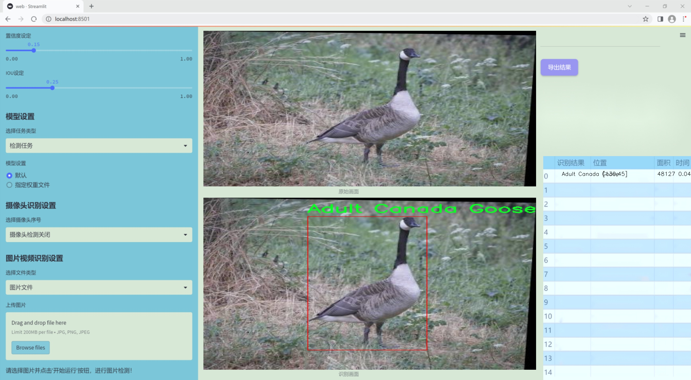
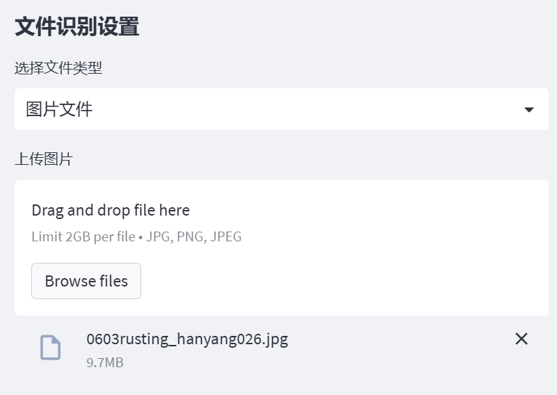

### 1.背景意义

研究背景与意义

随着生态保护意识的增强和生物多样性的重要性日益凸显，水鸟尤其是加拿大鹅的保护与管理成为了生态学研究的一个重要领域。加拿大鹅在北美地区广泛分布，其种群数量的变化不仅反映了生态环境的健康状况，也对当地生态系统的平衡产生深远影响。为了有效管理和保护这一物种，准确识别其不同成长阶段的个体成为了关键。尤其是在繁殖季节，区分成年鹅与幼鹅对于制定科学的保护措施、监测种群动态以及进行生态研究具有重要意义。

传统的鹅类识别方法依赖于人工观察，这不仅耗时耗力，而且容易受到观察者主观因素的影响，导致识别结果的不准确。随着计算机视觉技术的迅速发展，基于深度学习的图像识别方法逐渐成为解决这一问题的有效手段。YOLO（You Only Look Once）系列模型因其高效的实时检测能力和较高的准确率，成为了目标检测领域的热门选择。针对鹅的成熟与否识别，我们提出了一种基于改进YOLOv11的系统，旨在提高识别的准确性和效率。

本研究使用的数据集包含393张经过精心标注的图像，涵盖了成年加拿大鹅和幼鹅两个类别。通过对数据集的预处理和增强，确保了模型在不同环境和光照条件下的鲁棒性。研究的最终目标是开发一个能够实时识别鹅的成熟状态的系统，为生态保护工作提供技术支持。这不仅有助于提高对加拿大鹅种群的监测效率，也为其他鸟类的识别与保护提供了可借鉴的技术方案，推动了计算机视觉技术在生态保护领域的应用与发展。

### 2.视频效果

[2.1 视频效果](https://www.bilibili.com/video/BV1qEBvYwENL/)

### 3.图片效果




##### [项目涉及的源码数据来源链接](https://kdocs.cn/l/cszuIiCKVNis)**

注意：本项目提供训练的数据集和训练教程,由于版本持续更新,暂不提供权重文件（best.pt）,请按照6.训练教程进行训练后实现上图演示的效果。

### 4.数据集信息

##### 4.1 本项目数据集类别数＆类别名

nc: 2
names: ['Adult Canada Goose', 'Baby Canada Goose']


该项目为【目标检测】数据集，请在【训练教程和Web端加载模型教程（第三步）】这一步的时候按照【目标检测】部分的教程来训练

##### 4.2 本项目数据集信息介绍

本项目数据集信息介绍

本项目旨在开发一个改进的YOLOv11模型，以实现对鹅的成熟与否的高效识别。为此，我们构建了一个专门的数据集，名为“Goosebuster”，该数据集涵盖了两类主要的目标对象：成年加拿大鹅（Adult Canada Goose）和幼年加拿大鹅（Baby Canada Goose）。通过对这两类的细致分类，我们能够更准确地训练模型，以便在实际应用中实现对鹅的成熟状态的自动识别。

数据集的构建过程包括了对多种环境下的鹅进行拍摄，确保了数据的多样性和代表性。我们收集了在不同季节、不同栖息地以及不同光照条件下的鹅的图像，力求捕捉到成年鹅和幼鹅在外观上的细微差别。这些图像不仅包括静态的鹅的特写，还涵盖了它们在自然环境中活动的动态场景，确保模型能够适应多种复杂的背景和姿态变化。

在数据标注方面，我们采用了严格的标准，对每一张图像中的成年鹅和幼鹅进行了精确的标注。这一过程不仅提高了数据集的质量，也为后续的模型训练提供了坚实的基础。通过这种方式，我们的数据集不仅能够有效支持YOLOv11模型的训练，还能够为其在实际应用中的推广提供可靠的数据支撑。

总之，“Goosebuster”数据集的构建为本项目的成功奠定了基础。通过精确的分类和丰富的样本，我们期待改进后的YOLOv11模型能够在鹅的成熟与否识别任务中表现出色，为相关领域的研究和应用提供有力的技术支持。


### 5.全套项目环境部署视频教程（零基础手把手教学）

[5.1 所需软件PyCharm和Anaconda安装教程（第一步）](https://www.bilibili.com/video/BV1BoC1YCEKi/?spm_id_from=333.999.0.0&vd_source=bc9aec86d164b67a7004b996143742dc)


[5.2 安装Python虚拟环境创建和依赖库安装视频教程（第二步）](https://www.bilibili.com/video/BV1ZoC1YCEBw?spm_id_from=333.788.videopod.sections&vd_source=bc9aec86d164b67a7004b996143742dc)

### 6.改进YOLOv11训练教程和Web_UI前端加载模型教程（零基础手把手教学）

[6.1 改进YOLOv11训练教程和Web_UI前端加载模型教程（第三步）](https://www.bilibili.com/video/BV1BoC1YCEhR?spm_id_from=333.788.videopod.sections&vd_source=bc9aec86d164b67a7004b996143742dc)


按照上面的训练视频教程链接加载项目提供的数据集，运行train.py即可开始训练



     Epoch   gpu_mem       box       obj       cls    labels  img_size
     1/200     20.8G   0.01576   0.01955  0.007536        22      1280: 100%|██████████| 849/849 [14:42<00:00,  1.04s/it]
               Class     Images     Labels          P          R     mAP@.5 mAP@.5:.95: 100%|██████████| 213/213 [01:14<00:00,  2.87it/s]
                 all       3395      17314      0.994      0.957      0.0957      0.0843

     Epoch   gpu_mem       box       obj       cls    labels  img_size
     2/200     20.8G   0.01578   0.01923  0.007006        22      1280: 100%|██████████| 849/849 [14:44<00:00,  1.04s/it]
               Class     Images     Labels          P          R     mAP@.5 mAP@.5:.95: 100%|██████████| 213/213 [01:12<00:00,  2.95it/s]
                 all       3395      17314      0.996      0.956      0.0957      0.0845

     Epoch   gpu_mem       box       obj       cls    labels  img_size
     3/200     20.8G   0.01561    0.0191  0.006895        27      1280: 100%|██████████| 849/849 [10:56<00:00,  1.29it/s]
               Class     Images     Labels          P          R     mAP@.5 mAP@.5:.95: 100%|███████   | 187/213 [00:52<00:00,  4.04it/s]
                 all       3395      17314      0.996      0.957      0.0957      0.0845


###### [项目数据集下载链接](https://kdocs.cn/l/cszuIiCKVNis)

### 7.原始YOLOv11算法讲解


##### YOLOv11三大损失函数

YOLOv11（You Only Look Once）是一种流行的目标检测算法，其损失函数设计用于同时优化分类和定位任务。YOLO的损失函数通常包括几个部分：
**分类损失、定位损失（边界框回归损失）和置信度损失** 。其中，

  1. box_loss（边界框回归损失）是用于优化预测边界框与真实边界框之间的差异的部分。

  2. cls_loss（分类损失）是用于优化模型对目标类别的预测准确性的部分。分类损失确保模型能够正确地识别出图像中的对象属于哪个类别。

  3. dfl_loss（Distribution Focal Loss）是YOLO系列中的一种损失函数，特别是在一些改进版本如YOLOv5和YOLOv7中被引入。它的主要目的是解决目标检测中的类别不平衡问题，并提高模型在处理小目标和困难样本时的性能。

##### 边界框回归损失详解

box_loss（边界框回归损失）是用于优化预测边界框与真实边界框之间的差异的部分。


##### box_loss 的具体意义


##### 为什么需要 box_loss

  * 精确定位：通过最小化中心点坐标损失和宽高损失，模型能够更准确地预测目标的位置和大小。
  * 平衡不同类型的目标：使用平方根来处理宽高损失，可以更好地平衡不同大小的目标，确保小目标也能得到足够的关注。
  * 稳定训练：适当的损失函数设计有助于模型的稳定训练，避免梯度爆炸或消失等问题。

##### 分类损失详解

在YOLO（You Only Look
Once）目标检测算法中，cls_loss（分类损失）是用于优化模型对目标类别的预测准确性的部分。分类损失确保模型能够正确地识别出图像中的对象属于哪个类别。下面是关于cls_loss的详细解读：

##### 分类损失 (cls_loss) 的具体意义

  
分类损失通常使用交叉熵损失（Cross-Entropy
Loss）来计算。交叉熵损失衡量的是模型预测的概率分布与真实标签之间的差异。在YOLO中，分类损失的具体形式如下：


##### 为什么需要 cls_loss

  * 类别识别：cls_loss 确保模型能够正确识别出图像中的目标属于哪个类别。这对于目标检测任务至关重要，因为不仅需要知道目标的位置，还需要知道目标的类型。

  * 多类别支持：通过最小化分类损失，模型可以处理多个类别的目标检测任务。例如，在道路缺陷检测中，可能需要识别裂缝、坑洞、路面破损等多种类型的缺陷。

  * 提高准确性：分类损失有助于提高模型的分类准确性，从而提升整体检测性能。通过优化分类损失，模型可以更好地学习不同类别之间的特征差异。

##### 分布损失详解

`dfl_loss`（Distribution Focal
Loss）是YOLO系列中的一种损失函数，特别是在一些改进版本如YOLOv5和YOLOv7中被引入。它的主要目的是解决目标检测中的类别不平衡问题，并提高模型在处理小目标和困难样本时的性能。下面是对`dfl_loss`的详细解读：

##### DFL Loss 的背景

在目标检测任务中，类别不平衡是一个常见的问题。某些类别的样本数量可能远远多于其他类别，这会导致模型在训练过程中对常见类别的学习效果较好，而对罕见类别的学习效果较差。此外，小目标和困难样本的检测也是一个挑战，因为这些目标通常具有较少的特征信息，容易被忽略或误分类。

为了应对这些问题，研究者们提出了多种改进方法，其中之一就是`dfl_loss`。`dfl_loss`通过引入分布焦点损失来增强模型对困难样本的关注，并改善类别不平衡问题。

##### DFL Loss 的定义

DFL Loss
通常与传统的交叉熵损失结合使用，以增强模型对困难样本的学习能力。其核心思想是通过对每个类别的预测概率进行加权，使得模型更加关注那些难以正确分类的样本。

DFL Loss 的公式可以表示为：


##### DFL Loss 的具体意义**

  * **类别不平衡：** 通过引入平衡因子 α，DFL Loss 可以更好地处理类别不平衡问题。对于少数类别的样本，可以通过增加其权重来提升其重要性，从而提高模型对这些类别的检测性能。
  *  **困难样本：** 通过聚焦参数 γ，DFL Loss 可以让模型更加关注那些难以正确分类的样本。当 
  * γ 较大时，模型会对那些预测概率较低的样本给予更多的关注，从而提高这些样本的分类准确性。
  *  **提高整体性能** ：DFL Loss 结合了传统交叉熵损失的优势，并通过加权机制增强了模型对困难样本的学习能力，从而提高了整体的检测性能。


### 8.200+种全套改进YOLOV11创新点原理讲解

#### 8.1 200+种全套改进YOLOV11创新点原理讲解大全

由于篇幅限制，每个创新点的具体原理讲解就不全部展开，具体见下列网址中的改进模块对应项目的技术原理博客网址【Blog】（创新点均为模块化搭建，原理适配YOLOv5~YOLOv11等各种版本）

[改进模块技术原理博客【Blog】网址链接](https://gitee.com/qunmasj/good)


#### 8.2 精选部分改进YOLOV11创新点原理讲解

###### 这里节选部分改进创新点展开原理讲解(完整的改进原理见上图和[改进模块技术原理博客链接](https://gitee.com/qunmasj/good)【如果此小节的图加载失败可以通过CSDN或者Github搜索该博客的标题访问原始博客，原始博客图片显示正常】
### RepViT简介

近年来，与轻量级卷积神经网络(cnn)相比，轻量级视觉变压器(ViTs)在资源受限的移动设备上表现出了更高的性能和更低的延迟。这种改进通常归功于多头自注意模块，它使模型能够学习全局表示。然而，轻量级vit和轻量级cnn之间的架构差异还没有得到充分的研究。在这项研究中，我们重新审视了轻量级cnn的高效设计，并强调了它们在移动设备上的潜力。通过集成轻量级vit的高效架构选择，我们逐步增强了标准轻量级CNN的移动友好性，特别是MobileNetV3。这就产生了一个新的纯轻量级cnn家族，即RepViT。大量的实验表明，RepViT优于现有的轻型vit，并在各种视觉任务中表现出良好的延迟。在ImageNet上，RepViT在iPhone 12上以近1ms的延迟实现了超过80%的top-1精度，据我们所知，这是轻量级模型的第一次。

#### RepViT简介
轻量级模型研究一直是计算机视觉任务中的一个焦点，其目标是在降低计算成本的同时达到优秀的性能。轻量级模型与资源受限的移动设备尤其相关，使得视觉模型的边缘部署成为可能。在过去十年中，研究人员主要关注轻量级卷积神经网络（CNNs）的设计，提出了许多高效的设计原则，包括可分离卷积 、逆瓶颈结构 、通道打乱 和结构重参数化等，产生了 MobileNets ，ShuffleNets和 RepVGG 等代表性模型。

另一方面，视觉 Transformers（ViTs）成为学习视觉表征的另一种高效方案。与 CNNs 相比，ViTs 在各种计算机视觉任务中表现出了更优越的性能。然而，ViT 模型一般尺寸很大，延迟很高，不适合资源受限的移动设备。因此，研究人员开始探索 ViT 的轻量级设计。许多高效的ViTs设计原则被提出，大大提高了移动设备上 ViTs 的计算效率，产生了EfficientFormers ，MobileViTs等代表性模型。这些轻量级 ViTs 在移动设备上展现出了相比 CNNs 的更强的性能和更低的延迟。

轻量级 ViTs 优于轻量级 CNNs 的原因通常归结于多头注意力模块，该模块使模型能够学习全局表征。然而，轻量级 ViTs 和轻量级 CNNs 在块结构、宏观和微观架构设计方面存在值得注意的差异，但这些差异尚未得到充分研究。这自然引出了一个问题：轻量级 ViTs 的架构选择能否提高轻量级 CNN 的性能？在这项工作中，我们结合轻量级 ViTs 的架构选择，重新审视了轻量级 CNNs 的设计。我们的旨在缩小轻量级 CNNs 与轻量级 ViTs 之间的差距，并强调前者与后者相比在移动设备上的应用潜力。


在 ConvNeXt 中，参考该博客提出的基于 ResNet50 架构的基础上通过严谨的理论和实验分析，最终设计出一个非常优异的足以媲美 Swin-Transformer 的纯卷积神经网络架构。同样地，RepViT也是主要通过将轻量级 ViTs 的架构设计逐步整合到标准轻量级 CNN，即MobileNetV3-L，来对其进行针对性地改造（魔改）。在这个过程中，作者们考虑了不同粒度级别的设计元素，并通过一系列步骤达到优化的目标。


详细优化步骤如下：

#### 训练配方的对齐
论文中引入了一种衡量移动设备上延迟的指标，并将训练策略与现有的轻量级 ViTs 对齐。这一步骤主要是为了确保模型训练的一致性，其涉及两个概念，即延迟度量和训练策略的调整。

#### 延迟度量指标
为了更准确地衡量模型在真实移动设备上的性能，作者选择了直接测量模型在设备上的实际延迟，以此作为基准度量。这个度量方法不同于之前的研究，它们主要通过FLOPs或模型大小等指标优化模型的推理速度，这些指标并不总能很好地反映在移动应用中的实际延迟。

#### 训练策略的对齐
这里，将 MobileNetV3-L 的训练策略调整以与其他轻量级 ViTs 模型对齐。这包括使用 AdamW 优化器-ViTs 模型必备的优化器，进行 5 个 epoch 的预热训练，以及使用余弦退火学习率调度进行 300 个 epoch 的训练。尽管这种调整导致了模型准确率的略微下降，但可以保证公平性。

#### 块设计的优化
基于一致的训练设置，作者们探索了最优的块设计。块设计是 CNN 架构中的一个重要组成部分，优化块设计有助于提高网络的性能。

#### 分离 Token 混合器和通道混合器
这块主要是对 MobileNetV3-L 的块结构进行了改进，分离了令牌混合器和通道混合器。原来的 MobileNetV3 块结构包含一个 1x1 扩张卷积，然后是一个深度卷积和一个 1x1 的投影层，然后通过残差连接连接输入和输出。在此基础上，RepViT 将深度卷积提前，使得通道混合器和令牌混合器能够被分开。为了提高性能，还引入了结构重参数化来在训练时为深度滤波器引入多分支拓扑。最终，作者们成功地在 MobileNetV3 块中分离了令牌混合器和通道混合器，并将这种块命名为 RepViT 块。

#### 降低扩张比例并增加宽度
在通道混合器中，原本的扩张比例是 4，这意味着 MLP 块的隐藏维度是输入维度的四倍，消耗了大量的计算资源，对推理时间有很大的影响。为了缓解这个问题，我们可以将扩张比例降低到 2，从而减少了参数冗余和延迟，使得 MobileNetV3-L 的延迟降低到 0.65ms。随后，通过增加网络的宽度，即增加各阶段的通道数量，Top-1 准确率提高到 73.5%，而延迟只增加到 0.89ms！

#### 宏观架构元素的优化
在这一步，本文进一步优化了MobileNetV3-L在移动设备上的性能，主要是从宏观架构元素出发，包括 stem，降采样层，分类器以及整体阶段比例。通过优化这些宏观架构元素，模型的性能可以得到显著提高。

#### 浅层网络使用卷积提取器
ViTs 通常使用一个将输入图像分割成非重叠补丁的 “patchify” 操作作为 stem。然而，这种方法在训练优化性和对训练配方的敏感性上存在问题。因此，作者们采用了早期卷积来代替，这种方法已经被许多轻量级 ViTs 所采纳。对比之下，MobileNetV3-L 使用了一个更复杂的 stem 进行 4x 下采样。这样一来，虽然滤波器的初始数量增加到24，但总的延迟降低到0.86ms，同时 top-1 准确率提高到 73.9%。

#### 更深的下采样层
在 ViTs 中，空间下采样通常通过一个单独的补丁合并层来实现。因此这里我们可以采用一个单独和更深的下采样层，以增加网络深度并减少由于分辨率降低带来的信息损失。具体地，作者们首先使用一个 1x1 卷积来调整通道维度，然后将两个 1x1 卷积的输入和输出通过残差连接，形成一个前馈网络。此外，他们还在前面增加了一个 RepViT 块以进一步加深下采样层，这一步提高了 top-1 准确率到 75.4%，同时延迟为 0.96ms。

#### 更简单的分类器
在轻量级 ViTs 中，分类器通常由一个全局平均池化层后跟一个线性层组成。相比之下，MobileNetV3-L 使用了一个更复杂的分类器。因为现在最后的阶段有更多的通道，所以作者们将它替换为一个简单的分类器，即一个全局平均池化层和一个线性层，这一步将延迟降低到 0.77ms，同时 top-1 准确率为 74.8%。

#### 整体阶段比例
阶段比例代表了不同阶段中块数量的比例，从而表示了计算在各阶段中的分布。论文选择了一个更优的阶段比例 1:1:7:1，然后增加网络深度到 2:2:14:2，从而实现了一个更深的布局。这一步将 top-1 准确率提高到 76.9%，同时延迟为 1.02 ms。

#### 卷积核大小的选择
众所周知，CNNs 的性能和延迟通常受到卷积核大小的影响。例如，为了建模像 MHSA 这样的远距离上下文依赖，ConvNeXt 使用了大卷积核，从而实现了显著的性能提升。然而，大卷积核对于移动设备并不友好，因为它的计算复杂性和内存访问成本。MobileNetV3-L 主要使用 3x3 的卷积，有一部分块中使用 5x5 的卷积。作者们将它们替换为3x3的卷积，这导致延迟降低到 1.00ms，同时保持了76.9%的top-1准确率。

#### SE 层的位置
自注意力模块相对于卷积的一个优点是根据输入调整权重的能力，这被称为数据驱动属性。作为一个通道注意力模块，SE层可以弥补卷积在缺乏数据驱动属性上的限制，从而带来更好的性能。MobileNetV3-L 在某些块中加入了SE层，主要集中在后两个阶段。然而，与分辨率较高的阶段相比，分辨率较低的阶段从SE提供的全局平均池化操作中获得的准确率提升较小。作者们设计了一种策略，在所有阶段以交叉块的方式使用SE层，从而在最小的延迟增量下最大化准确率的提升，这一步将top-1准确率提升到77.4%，同时延迟降低到0.87ms。

注意！【这一点其实百度在很早前就已经做过实验比对得到过这个结论了，SE 层放置在靠近深层的地方效果好】

#### 微观设计的调整
RepViT 通过逐层微观设计来调整轻量级 CNN，这包括选择合适的卷积核大小和优化挤压-激励（Squeeze-and-excitation，简称SE）层的位置。这两种方法都能显著改善模型性能。

#### 网络架构
最终，通过整合上述改进策略，我们便得到了模型RepViT的整体架构，该模型有多个变种，例如RepViT-M1/M2/M3。同样地，不同的变种主要通过每个阶段的通道数和块数来区分。


### 9.系统功能展示

图9.1.系统支持检测结果表格显示

  图9.2.系统支持置信度和IOU阈值手动调节

  图9.3.系统支持自定义加载权重文件best.pt(需要你通过步骤5中训练获得)

  图9.4.系统支持摄像头实时识别

  图9.5.系统支持图片识别

  图9.6.系统支持视频识别

  图9.7.系统支持识别结果文件自动保存

  图9.8.系统支持Excel导出检测结果数据





### 10. YOLOv11核心改进源码讲解

#### 10.1 mamba_yolo.py

以下是对给定代码的核心部分进行分析和详细注释的结果。为了简化代码并保留其核心功能，我将主要关注几个关键类和函数。

```python
import torch
import torch.nn as nn
from einops import rearrange

class LayerNorm2d(nn.Module):
    """二维层归一化类，适用于图像数据的归一化处理。"""
    
    def __init__(self, normalized_shape, eps=1e-6, elementwise_affine=True):
        super().__init__()
        self.norm = nn.LayerNorm(normalized_shape, eps, elementwise_affine)

    def forward(self, x):
        # 将输入张量从 (B, C, H, W) 转换为 (B, H, W, C)
        x = rearrange(x, 'b c h w -> b h w c').contiguous()
        # 应用层归一化
        x = self.norm(x)
        # 将张量转换回 (B, C, H, W)
        x = rearrange(x, 'b h w c -> b c h w').contiguous()
        return x


class CrossScan(torch.autograd.Function):
    """交叉扫描操作，处理输入张量并生成不同方向的视图。"""
    
    @staticmethod
    def forward(ctx, x: torch.Tensor):
        B, C, H, W = x.shape
        ctx.shape = (B, C, H, W)
        xs = x.new_empty((B, 4, C, H * W))
        # 生成不同方向的视图
        xs[:, 0] = x.flatten(2, 3)  # 原始方向
        xs[:, 1] = x.transpose(dim0=2, dim1=3).flatten(2, 3)  # 旋转90度
        xs[:, 2:4] = torch.flip(xs[:, 0:2], dims=[-1])  # 反转方向
        return xs

    @staticmethod
    def backward(ctx, ys: torch.Tensor):
        B, C, H, W = ctx.shape
        L = H * W
        # 反向传播计算
        ys = ys[:, 0:2] + ys[:, 2:4].flip(dims=[-1]).view(B, 2, -1, L)
        y = ys[:, 0] + ys[:, 1].view(B, -1, W, H).transpose(dim0=2, dim1=3).contiguous().view(B, -1, L)
        return y.view(B, -1, H, W)


class SelectiveScanCore(torch.autograd.Function):
    """选择性扫描核心操作，执行高效的选择性扫描计算。"""
    
    @staticmethod
    @torch.cuda.amp.custom_fwd
    def forward(ctx, u, delta, A, B, C, D=None, delta_bias=None, delta_softplus=False, nrows=1, backnrows=1):
        # 确保输入张量是连续的
        if u.stride(-1) != 1:
            u = u.contiguous()
        if delta.stride(-1) != 1:
            delta = delta.contiguous()
        if D is not None and D.stride(-1) != 1:
            D = D.contiguous()
        if B.stride(-1) != 1:
            B = B.contiguous()
        if C.stride(-1) != 1:
            C = C.contiguous()
        
        # 处理输入数据并调用CUDA核心函数
        out, x, *rest = selective_scan_cuda_core.fwd(u, delta, A, B, C, D, delta_bias, delta_softplus, 1)
        ctx.save_for_backward(u, delta, A, B, C, D, delta_bias, x)
        return out

    @staticmethod
    @torch.cuda.amp.custom_bwd
    def backward(ctx, dout):
        u, delta, A, B, C, D, delta_bias, x = ctx.saved_tensors
        # 反向传播计算
        du, ddelta, dA, dB, dC, dD, ddelta_bias, *rest = selective_scan_cuda_core.bwd(
            u, delta, A, B, C, D, delta_bias, dout, x, ctx.delta_softplus, 1
        )
        return (du, ddelta, dA, dB, dC, dD, ddelta_bias, None, None, None, None)


class SS2D(nn.Module):
    """选择性扫描2D模块，结合卷积和选择性扫描的功能。"""
    
    def __init__(self, d_model=96, d_state=16, ssm_ratio=2.0, ssm_rank_ratio=2.0, dropout=0.0):
        super().__init__()
        self.in_proj = nn.Conv2d(d_model, d_model * ssm_ratio, kernel_size=1, bias=False)
        self.out_proj = nn.Conv2d(d_model * ssm_ratio, d_model, kernel_size=1, bias=False)
        self.dropout = nn.Dropout(dropout)

    def forward(self, x: torch.Tensor):
        x = self.in_proj(x)  # 输入投影
        # 进行选择性扫描操作
        # 此处省略选择性扫描的具体实现
        x = self.out_proj(x)  # 输出投影
        return self.dropout(x)


class VSSBlock_YOLO(nn.Module):
    """YOLO模型中的VSS块，结合选择性扫描和其他操作。"""
    
    def __init__(self, in_channels: int, hidden_dim: int, drop_path: float = 0):
        super().__init__()
        self.proj_conv = nn.Conv2d(in_channels, hidden_dim, kernel_size=1, bias=True)
        self.ss2d = SS2D(d_model=hidden_dim)  # 选择性扫描模块
        self.drop_path = nn.Dropout(drop_path)

    def forward(self, input: torch.Tensor):
        input = self.proj_conv(input)  # 投影
        x = self.ss2d(input)  # 选择性扫描
        return self.drop_path(x)  # 返回结果
```

### 代码核心部分分析
1. **LayerNorm2d**: 该类实现了二维层归一化，适用于图像数据，能够有效地进行归一化处理。
2. **CrossScan**: 该类实现了交叉扫描操作，能够生成不同方向的视图，便于后续处理。
3. **SelectiveScanCore**: 该类实现了选择性扫描的核心操作，能够高效地执行选择性扫描计算，并支持反向传播。
4. **SS2D**: 该类结合了卷积和选择性扫描的功能，是一个重要的模块，用于处理输入数据。
5. **VSSBlock_YOLO**: 该类是YOLO模型中的一个块，结合了投影卷积和选择性扫描模块，形成了一个完整的前向传播过程。

以上是对代码的核心部分进行了提炼和详细注释，希望对你理解代码的功能和结构有所帮助。

这个程序文件 `mamba_yolo.py` 是一个用于构建深度学习模型的 PyTorch 实现，主要涉及到视觉任务中的一些高级模块和功能。以下是对文件中各个部分的逐步分析和说明。

首先，文件导入了一些必要的库，包括 `torch` 和 `torch.nn`，这些是构建神经网络的基础库。还使用了 `einops` 库来处理张量的重排，以及 `timm` 库中的 `DropPath` 用于实现随机深度的残差连接。

文件中定义了多个类和函数，主要包括自定义的层、模块和一些辅助函数。`LayerNorm2d` 类实现了二维的层归一化，适用于图像数据。`autopad` 函数用于计算卷积操作的自动填充，以确保输出尺寸与输入相同。

接下来是 `CrossScan` 和 `CrossMerge` 类，这两个类实现了交叉扫描和合并的功能，主要用于处理多维张量的操作。它们通过定义前向和反向传播的方法来实现自定义的计算图。

`SelectiveScanCore` 类是一个重要的部分，它实现了选择性扫描的核心功能，允许在计算过程中对张量进行高效的操作。这个类的前向和反向方法使用了 CUDA 加速，适合在 GPU 上运行。

`cross_selective_scan` 函数则是对选择性扫描的封装，提供了更高层次的接口，方便在模型中调用。它处理输入张量，进行线性变换，并应用选择性扫描操作，最后返回处理后的结果。

接下来是 `SS2D` 类，它实现了一个具有选择性扫描机制的二维模块。该模块包括输入投影、卷积操作和输出投影等步骤，并使用了层归一化和激活函数。它的设计考虑了低秩矩阵的情况，以提高计算效率。

`RGBlock` 和 `LSBlock` 类分别实现了残差块和轻量级块，这些模块通常用于构建更复杂的网络结构。它们通过卷积和激活函数组合来提取特征，并使用跳跃连接来保持信息流。

`XSSBlock` 和 `VSSBlock_YOLO` 类是更高级的模块，结合了选择性扫描和其他特征提取技术，旨在提高模型的表现力和效率。这些模块可以在视觉任务中有效地捕捉空间信息。

`SimpleStem` 类实现了一个简单的卷积骨干，用于处理输入图像并提取初步特征。`VisionClueMerge` 类则用于将不同分辨率的特征图合并，以便在后续的处理阶段中使用。

总体而言，这个文件实现了一个复杂的深度学习模型的多个组件，主要用于视觉任务。通过自定义的层和模块，程序能够高效地处理图像数据，并利用选择性扫描等技术提高模型的性能。

#### 10.2 UniRepLKNet.py

以下是经过简化和注释的核心代码部分，主要包括 `UniRepLKNet` 模型的定义和相关模块。注释详细解释了每个部分的功能和作用。

```python
import torch
import torch.nn as nn
import torch.nn.functional as F
from functools import partial

class GRNwithNHWC(nn.Module):
    """ GRN (Global Response Normalization) 层
    该层用于对输入进行全局响应归一化，输入格式为 (N, H, W, C)
    """
    def __init__(self, dim, use_bias=True):
        super().__init__()
        self.use_bias = use_bias
        self.gamma = nn.Parameter(torch.zeros(1, 1, 1, dim))  # 可学习参数 gamma
        if self.use_bias:
            self.beta = nn.Parameter(torch.zeros(1, 1, 1, dim))  # 可学习参数 beta

    def forward(self, x):
        Gx = torch.norm(x, p=2, dim=(1, 2), keepdim=True)  # 计算输入的 L2 范数
        Nx = Gx / (Gx.mean(dim=-1, keepdim=True) + 1e-6)  # 归一化
        if self.use_bias:
            return (self.gamma * Nx + 1) * x + self.beta  # 加入偏置
        else:
            return (self.gamma * Nx + 1) * x  # 不加偏置

class UniRepLKNetBlock(nn.Module):
    """ UniRepLKNet 的基本构建块
    包含深度卷积、归一化、激活函数和 Squeeze-and-Excitation (SE) 模块
    """
    def __init__(self, dim, kernel_size, drop_path=0., deploy=False, use_sync_bn=False):
        super().__init__()
        # 定义深度卷积层
        self.dwconv = nn.Conv2d(dim, dim, kernel_size=kernel_size, stride=1, padding=kernel_size // 2, groups=dim)
        self.norm = nn.BatchNorm2d(dim) if not deploy else nn.Identity()  # 归一化层
        self.se = SEBlock(dim, dim // 4)  # Squeeze-and-Excitation 模块
        self.drop_path = nn.Identity() if drop_path <= 0 else DropPath(drop_path)  # 随机深度

    def forward(self, inputs):
        # 前向传播
        y = self.se(self.norm(self.dwconv(inputs)))  # 经过深度卷积、归一化和 SE 模块
        return self.drop_path(y) + inputs  # 残差连接

class UniRepLKNet(nn.Module):
    """ UniRepLKNet 模型
    包含多个 UniRepLKNetBlock 组成的网络结构
    """
    def __init__(self, in_chans=3, num_classes=1000, depths=(3, 3, 27, 3), dims=(96, 192, 384, 768)):
        super().__init__()
        self.downsample_layers = nn.ModuleList()  # 下采样层
        # 初始化下采样层
        self.downsample_layers.append(nn.Conv2d(in_chans, dims[0] // 2, kernel_size=3, stride=2, padding=1))
        for i in range(3):
            self.downsample_layers.append(nn.Conv2d(dims[i], dims[i + 1], kernel_size=3, stride=2, padding=1))

        self.stages = nn.ModuleList()  # 各个阶段的块
        for i in range(4):
            stage = nn.Sequential(*[UniRepLKNetBlock(dim=dims[i], kernel_size=3) for _ in range(depths[i])])
            self.stages.append(stage)

    def forward(self, x):
        # 前向传播
        for stage in self.stages:
            x = stage(x)  # 经过每个阶段的块
        return x

def unireplknet_a(weights='', **kwargs):
    """ 创建 UniRepLKNet A 模型并加载权重 """
    model = UniRepLKNet(depths=(2, 2, 6, 2), dims=(40, 80, 160, 320), **kwargs)
    if weights:
        model.load_state_dict(torch.load(weights))  # 加载权重
    return model

if __name__ == '__main__':
    inputs = torch.randn((1, 3, 640, 640))  # 输入示例
    model = unireplknet_a()  # 创建模型
    res = model(inputs)  # 前向传播
    print(res.shape)  # 输出结果形状
```

### 代码说明：
1. **GRNwithNHWC**: 实现了全局响应归一化层，用于调整特征图的响应。
2. **UniRepLKNetBlock**: 这是模型的基本构建块，包含深度卷积、归一化、Squeeze-and-Excitation 模块和残差连接。
3. **UniRepLKNet**: 整个模型的实现，包含多个阶段，每个阶段由多个 `UniRepLKNetBlock` 组成。
4. **unireplknet_a**: 用于创建 `UniRepLKNet` 模型并加载预训练权重的函数。
5. **主程序**: 创建模型并进行一次前向传播，输出结果的形状。

以上是核心代码的简化和注释，提供了对模型结构和功能的清晰理解。

这个程序文件名为 `UniRepLKNet.py`，实现了一个名为 UniRepLKNet 的深度学习模型，主要用于音频、视频、点云、时间序列和图像识别等任务。该模型基于多个已有的模型架构，如 RepLKNet、ConvNeXt、DINO 和 DeiT，提供了一种通用的感知大核卷积网络。

文件开头包含了一些版权信息和引用的开源项目链接。接下来，程序导入了必要的 PyTorch 库和其他模块，包括用于卷积、归一化和激活函数的类。

在代码中，首先定义了一些基础模块，例如 GRN（全局响应归一化）层、NCHW 到 NHWC 的转换层，以及 NHWC 到 NCHW 的转换层。这些模块在后续的网络结构中会被多次使用。

`get_conv2d` 函数用于根据输入参数选择合适的卷积实现，支持原生卷积和 iGEMM 大核卷积实现。`get_bn` 函数则根据是否使用同步批归一化来返回相应的归一化层。

`SEBlock` 类实现了 Squeeze-and-Excitation 模块，用于增强网络的特征表达能力。`fuse_bn` 函数用于将卷积层和批归一化层融合，以减少推理时的计算量。

`DilatedReparamBlock` 类实现了稀疏重参数化块，允许使用不同的卷积核和扩张率来处理输入特征。该模块在前向传播时会使用多个卷积层并进行相应的归一化处理。

`UniRepLKNetBlock` 类是 UniRepLKNet 的基本构建块，结合了深度卷积、归一化、激活和 Squeeze-and-Excitation 模块。它还支持在训练和推理模式之间切换。

`UniRepLKNet` 类是整个模型的核心，定义了网络的结构，包括输入通道数、分类头的类别数、每个阶段的深度和特征维度等。模型的前向传播方法根据设定的输出模式（特征或 logits）来处理输入数据。

`LayerNorm` 类实现了层归一化，支持不同的数据格式（通道优先或通道最后）。最后，程序定义了一些函数（如 `unireplknet_a`、`unireplknet_f` 等）用于创建不同配置的 UniRepLKNet 模型，并加载预训练权重。

在文件的最后部分，提供了一个简单的测试代码，创建了一个随机输入并通过模型进行推理，展示了模型的基本功能。

整体来看，这个文件实现了一个复杂的深度学习模型，结合了多种技术和模块，旨在提高图像和其他类型数据的识别性能。

#### 10.3 pkinet.py

以下是代码中最核心的部分，并附上详细的中文注释：

```python
import math
import torch
import torch.nn as nn
from typing import Optional, Sequence

class DropPath(nn.Module):
    """随机丢弃路径（Stochastic Depth）模块，用于残差块的主路径中。
    
    Args:
        drop_prob (float): 路径被置为零的概率。默认值: 0.1
    """

    def __init__(self, drop_prob: float = 0.1):
        super().__init__()
        self.drop_prob = drop_prob  # 设置丢弃概率

    def forward(self, x: torch.Tensor) -> torch.Tensor:
        # 如果丢弃概率为0或不在训练模式下，直接返回输入
        if self.drop_prob == 0. or not self.training:
            return x
        keep_prob = 1 - self.drop_prob  # 计算保留概率
        shape = (x.shape[0], ) + (1, ) * (x.ndim - 1)  # 处理不同维度的张量
        random_tensor = keep_prob + torch.rand(shape, dtype=x.dtype, device=x.device)  # 生成随机张量
        output = x.div(keep_prob) * random_tensor.floor()  # 应用丢弃路径
        return output

class ConvFFN(BaseModule):
    """使用ConvModule实现的多层感知机（MLP）"""
    
    def __init__(self, in_channels: int, out_channels: Optional[int] = None, hidden_channels_scale: float = 4.0):
        super().__init__()
        out_channels = out_channels or in_channels  # 如果未指定输出通道，则使用输入通道
        hidden_channels = int(in_channels * hidden_channels_scale)  # 计算隐藏通道数

        # 定义前馈网络的层
        self.ffn_layers = nn.Sequential(
            nn.LayerNorm(in_channels),  # 归一化层
            ConvModule(in_channels, hidden_channels, kernel_size=1),  # 1x1卷积
            ConvModule(hidden_channels, hidden_channels, kernel_size=3, padding=1, groups=hidden_channels),  # 深度卷积
            nn.GELU(),  # 激活函数
            nn.Dropout(0.1),  # Dropout层
            ConvModule(hidden_channels, out_channels, kernel_size=1),  # 1x1卷积
        )

    def forward(self, x):
        return self.ffn_layers(x)  # 前向传播

class PKINet(BaseModule):
    """多核Inception网络"""
    
    def __init__(self, arch: str = 'S'):
        super().__init__()
        self.stages = nn.ModuleList()  # 定义网络的各个阶段
        self.stem = Stem(3, 32)  # Stem层
        self.stages.append(self.stem)  # 添加Stem层到网络

        # 定义网络的各个阶段
        for i in range(4):  # 假设有4个阶段
            stage = PKIStage(32, 64)  # 每个阶段的输入输出通道
            self.stages.append(stage)

    def forward(self, x):
        for stage in self.stages:
            x = stage(x)  # 依次通过每个阶段
        return x  # 返回最终输出

# 定义网络的实例
def PKINET_T():
    return PKINet('T')

if __name__ == '__main__':
    model = PKINET_T()  # 创建模型实例
    inputs = torch.randn((1, 3, 640, 640))  # 随机输入
    res = model(inputs)  # 前向传播
    print(res.size())  # 输出结果的尺寸
```

### 代码说明：
1. **DropPath 类**：实现了随机丢弃路径的功能，用于训练深度神经网络时的随机深度策略。通过在前向传播中根据丢弃概率决定是否丢弃某些路径，帮助模型更好地泛化。

2. **ConvFFN 类**：实现了一个多层感知机，使用卷积层代替全连接层。通过一系列卷积和激活函数的组合，进行特征的非线性变换。

3. **PKINet 类**：定义了一个多核Inception网络的结构，包含多个阶段（stages），每个阶段由不同的卷积层和其他模块组成。该网络的设计旨在通过不同的卷积核大小提取多尺度特征。

4. **主程序**：创建了一个PKINET_T模型实例，并对随机输入进行前向传播，输出结果的尺寸。

这个程序文件 `pkinet.py` 实现了一个名为 PKINet 的深度学习模型，主要用于计算机视觉任务。该模型采用了多种深度学习模块，包括卷积层、注意力机制、残差连接等，旨在提高图像处理的效果。

首先，文件导入了必要的库，包括 `torch` 和 `torch.nn`，以及一些类型提示和数学运算库。接着，尝试从 `mmcv` 和 `mmengine` 中导入一些模块，这些模块提供了构建卷积层和初始化权重的功能。如果导入失败，则使用 PyTorch 的基本模块。

文件中定义了一些辅助函数和类。`drop_path` 函数实现了随机深度（Stochastic Depth）技术，用于在训练过程中随机丢弃某些路径，以增强模型的泛化能力。`DropPath` 类则是对这个函数的封装，方便在模型中使用。

`autopad` 函数用于自动计算卷积层的填充，确保卷积操作的输出尺寸符合预期。`make_divisible` 函数确保通道数是某个值的倍数，这在模型设计中是常见的需求。

接下来，定义了一些基本的张量变换类，如 `BCHW2BHWC` 和 `BHWC2BCHW`，用于在不同的张量格式之间转换。`GSiLU` 类实现了一种激活函数，结合了全局平均池化和 Sigmoid 函数。`CAA` 类实现了上下文锚点注意力机制，用于增强特征表示。

`ConvFFN` 类实现了一个多层感知机，使用卷积模块来处理输入特征。`Stem` 和 `DownSamplingLayer` 类分别实现了模型的初始层和下采样层，负责处理输入数据的维度。

`InceptionBottleneck` 类实现了一个瓶颈结构，结合了多个卷积层和注意力机制，以提取更丰富的特征。`PKIBlock` 类则是多核 Inception 模块的实现，集成了多个瓶颈结构和前馈网络。

`PKIStage` 类定义了模型的一个阶段，包含多个 `PKIBlock`，并实现了下采样功能。最后，`PKINet` 类整合了所有的模块，构建了完整的网络结构。它的构造函数接受不同的参数以设置网络的架构，包括通道数、块数、卷积核大小等。

在 `PKINet` 中，定义了不同的网络架构设置（如 T、S、B），可以根据需要创建不同的模型实例。`init_weights` 方法用于初始化模型的权重，确保模型在训练开始时具有良好的性能。

最后，文件提供了三个函数 `PKINET_T`、`PKINET_S` 和 `PKINET_B`，用于创建不同版本的 PKINet 模型。在主程序中，创建了一个 PKINET_T 模型实例，并对随机生成的输入数据进行了前向传播，输出了各层的特征图尺寸。

整体来看，这个文件实现了一个复杂的深度学习模型，利用了多种先进的技术，适合用于图像分类、目标检测等计算机视觉任务。

### 11.完整训练+Web前端界面+200+种全套创新点源码、数据集获取


# [下载链接：https://mbd.pub/o/bread/Z5iZmpZu](https://mbd.pub/o/bread/Z5iZmpZu)